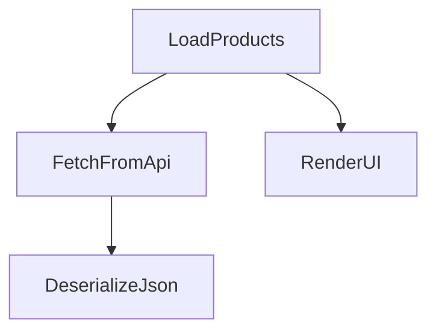
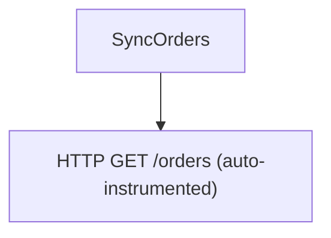
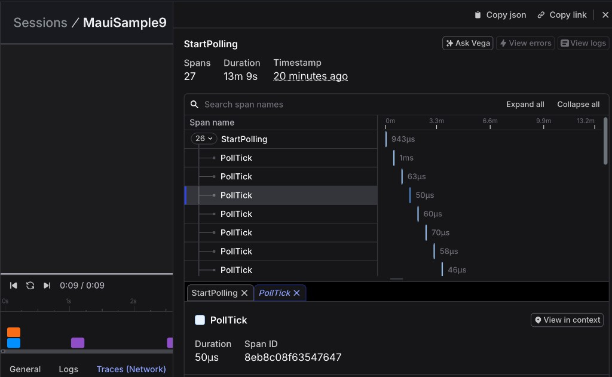

# Distributed Tracing Guide

This cookbook covers common distributed tracing patterns with the LaunchDarkly Observability SDK for .NET MAUI. Each recipe is self-contained and demonstrates a single concept with realistic examples.

All examples assume the SDK has already been initialized (see [Basic Setup](../README.md#basic-setup)) and the following imports are present:

```csharp
using LaunchDarkly.Observability;
using OpenTelemetry.Trace;
```

---

## 1. Get a Tracer and Start a Root Span

Create an independent span with no parent using `StartRootSpan`. Wrap it in a `using` statement so it ends automatically when the scope exits.

```csharp
using var span = LDObserve.StartRootSpan("app-cold-start");
span.SetAttribute("launch_type", "cold");
span.SetAttribute("device_model", DeviceInfo.Model);
span.AddEvent("splash_rendered");

// ... initialization work ...

span.AddEvent("home_screen_ready");
```

Use `StartRootSpan` when you want a span that is guaranteed to start a new trace, regardless of any ambient context.

---

## 2. Nested Spans for a Typical MAUI Workflow

`StartActiveSpan` automatically parents each new span under the currently active one. This is the most common pattern for tracing multi-step operations.

```csharp
private async Task LoadProductsAsync()
{
    using var loadSpan = LDObserve.StartActiveSpan("LoadProducts");

    List<Product> products;
    using (var fetchSpan = LDObserve.StartActiveSpan("FetchFromApi"))
    {
        var response = await _httpClient.GetAsync("https://api.example.com/products");
        fetchSpan.SetAttribute("http.status_code", (int)response.StatusCode);
        var json = await response.Content.ReadAsStringAsync();

        using var parseSpan = LDObserve.StartActiveSpan("DeserializeJson");
        products = JsonSerializer.Deserialize<List<Product>>(json)!;
        parseSpan.SetAttribute("product_count", products.Count);
    }

    using (var renderSpan = LDObserve.StartActiveSpan("RenderUI"))
    {
        Products.Clear();
        foreach (var p in products)
            Products.Add(p);
    }
}
```

The resulting trace tree:



---

## 3. HTTP Client Span with Manual Error Handling

Wrap an HTTP call in a span to capture timing, status codes, and errors in a single trace unit.

```csharp
private async Task<UserProfile?> FetchUserProfileAsync(string userId)
{
    using var span = LDObserve.StartActiveSpan("FetchUserProfile");
    span.SetAttribute("user.id", userId);
    span.SetAttribute("http.method", "GET");

    try
    {
        var url = $"https://api.example.com/users/{userId}";
        span.SetAttribute("http.url", url);

        var response = await _httpClient.GetAsync(url);
        span.SetAttribute("http.status_code", (int)response.StatusCode);

        if (!response.IsSuccessStatusCode)
        {
            span.SetStatus(Status.Error);
            span.SetAttribute("error.type", $"HTTP {response.StatusCode}");
            return null;
        }

        var profile = await response.Content.ReadFromJsonAsync<UserProfile>();
        span.SetStatus(Status.Ok);
        return profile;
    }
    catch (Exception ex)
    {
        span.RecordException(ex);
        span.SetStatus(Status.Error);
        throw;
    }
}
```

---

## 4. Automatic HttpClient Instrumentation Under a Custom Parent

When `InstrumentationOptions.NetworkRequests` is enabled (the default), every `HttpClient` request generates a `System.Net.Http` span automatically. If a custom span is active at call time, the HTTP span becomes its child.

```csharp
private async Task SyncOrdersAsync()
{
    using var span = LDObserve.StartActiveSpan("SyncOrders");
    span.SetAttribute("sync.direction", "pull");

    // The HTTP span for this GET is auto-created as a child of "SyncOrders"
    var response = await _httpClient.GetAsync("https://api.example.com/orders?since=yesterday");
    span.SetAttribute("http.status_code", (int)response.StatusCode);

    var orders = await response.Content.ReadFromJsonAsync<List<Order>>();
    span.SetAttribute("order_count", orders?.Count ?? 0);
}
```

The resulting trace tree:



You do not need to create a span for the HTTP call itself; the SDK handles it. Your business-logic span provides the parent context.

---

## 5. Record Exception and Mark Span as Failed

Use `RecordException` to attach structured error data to a span, then `SetStatus` to mark it as failed. This ensures the error is visible in your trace backend.

```csharp
private async Task ProcessPaymentAsync(string orderId, decimal amount)
{
    using var span = LDObserve.StartActiveSpan("ProcessPayment");
    span.SetAttribute("order.id", orderId);
    span.SetAttribute("payment.amount", (double)amount);

    try
    {
        var result = await _paymentGateway.ChargeAsync(orderId, amount);
        span.SetAttribute("payment.transaction_id", result.TransactionId);
        span.SetStatus(Status.Ok);
    }
    catch (TimeoutException ex)
    {
        span.RecordException(ex);
        span.SetStatus(Status.Error);
        span.SetAttribute("error.category", "timeout");

        LDObserve.RecordError(ex);
        throw;
    }
    catch (Exception ex)
    {
        span.RecordException(ex);
        span.SetStatus(Status.Error);

        LDObserve.RecordError(ex);
        throw;
    }
}
```

`RecordException` adds an `exception` event with `exception.type`, `exception.message`, and `exception.stacktrace` attributes following the OpenTelemetry semantic conventions.

---

## 6. Correlated Logs Inside the Active Span

When a `TelemetrySpan` is active, `RecordLog` automatically picks up the ambient trace and span IDs from `Activity.Current`. No extra work is needed to correlate them.

```csharp
private async Task ImportCatalogAsync(Stream csvStream)
{
    using var span = LDObserve.StartActiveSpan("ImportCatalog");

    LDObserve.RecordLog("Import started", Severity.Info,
        new Dictionary<string, object?> { { "source", "csv" } });

    var imported = 0;
    await foreach (var record in ParseCsvAsync(csvStream))
    {
        await _db.UpsertProductAsync(record);
        imported++;
    }

    span.SetAttribute("imported_count", imported);

    LDObserve.RecordLog("Import completed", Severity.Info,
        new Dictionary<string, object?> { { "imported_count", imported } });
}
```

Both log records will carry the same `traceId` and `spanId` as the `ImportCatalog` span, linking them together in your observability backend.

---

## 7. Passing SpanContext to Correlate Logs Across Threads

`Activity.Current` is an `AsyncLocal` value. When work runs on a detached thread (e.g. `Task.Run`, a timer callback, or fire-and-forget), the ambient context is lost. Capture `span.Context` and pass it explicitly.

```csharp
private async void OnUploadClicked(object? sender, EventArgs e)
{
    var span = LDObserve.StartActiveSpan("UploadReport");
    span.SetAttribute("report.type", "daily");
    var capturedContext = span.Context;
    span.End();

    await Task.Run(() =>
    {
        // Activity.Current is null here -- pass capturedContext explicitly
        LDObserve.RecordLog(
            "Upload processing on background thread",
            Severity.Info,
            new Dictionary<string, object?> { { "thread", Environment.CurrentManagedThreadId } },
            spanContext: capturedContext);

        // ... heavy processing ...

        LDObserve.RecordLog(
            "Upload complete",
            Severity.Info,
            spanContext: capturedContext);
    });
}
```

---

## 8. Creating a Child Span Where Automatic Propagation Won't Work

Sometimes you need a full child *span* (not just a correlated log) on a thread where `Activity.Current` is not propagated. Capture the parent's `SpanContext` and pass it to `LDObserve.StartActiveSpan(name, parentContext)` to re-establish the parent-child relationship.

```csharp
private void StartBackgroundSync()
{
    using var parentSpan = LDObserve.StartActiveSpan("ScheduleSync");
    parentSpan.SetAttribute("sync.mode", "background");
    var parentContext = parentSpan.Context;

    // Task.Run loses Activity.Current
    _ = Task.Run(async () =>
    {
        using var childSpan = LDObserve.StartActiveSpan("BackgroundSync", parentContext);
        childSpan.SetAttribute("thread.id", Environment.CurrentManagedThreadId);

        var response = await _httpClient.GetAsync("https://api.example.com/sync");
        childSpan.SetAttribute("http.status_code", (int)response.StatusCode);

        childSpan.AddEvent("sync.complete");
    });
}
```

The same technique applies to platform timer callbacks:

```csharp
private void StartPolling()
{
    using var span = LDObserve.StartActiveSpan("StartPolling");
    var parentContext = span.Context;

    var timer = Application.Current!.Dispatcher.CreateTimer();
    timer.Interval = TimeSpan.FromSeconds(30);
    timer.Tick += (s, e) =>
    {
        // Timer callbacks run on the UI thread with no ambient span context
        using var pollSpan = LDObserve.StartActiveSpan("PollTick", parentContext);
        pollSpan.SetAttribute("tick.time", DateTime.UtcNow.ToString("O"));

        // ... polling logic ...
    };
    timer.Start();
}
```

If you need a specific `SpanKind` (e.g. `SpanKind.Client` for an outgoing call), use the 3-parameter form:

```csharp
using var span = LDObserve.StartActiveSpan("ExternalCall", SpanKind.Client, parentContext);
```

Here is what the resulting trace looks like -- `StartPolling` is the short-lived parent, with each `PollTick` appearing as a child span fired at 30-second intervals:



---

## 9. Sequential Independent Root Spans

Use `StartRootSpan` to create spans that belong to separate traces. This is useful for batch operations or analytics events where each item should be its own trace.

```csharp
private void ProcessAnalyticsQueue(IReadOnlyList<AnalyticsEvent> events)
{
    foreach (var evt in events)
    {
        using var span = LDObserve.StartRootSpan($"Analytics:{evt.Type}");
        span.SetAttribute("event.type", evt.Type);
        span.SetAttribute("event.timestamp", evt.Timestamp.ToString("O"));
        span.SetAttribute("event.user_id", evt.UserId);

        try
        {
            _analyticsService.Process(evt);
            span.SetStatus(Status.Ok);
        }
        catch (Exception ex)
        {
            span.RecordException(ex);
            span.SetStatus(Status.Error);
        }
    }
}
```

Each iteration creates an independent trace. Without `StartRootSpan`, successive `StartActiveSpan` calls would nest under whatever span is currently active.

---

## 10. Span Events as Lightweight Checkpoints

Use `AddEvent` to mark milestones within a long-running span without creating child spans. Events are cheaper than spans and ideal for logging progress through a linear pipeline.

```csharp
private async Task DownloadAndCacheImageAsync(string url)
{
    using var span = LDObserve.StartActiveSpan("DownloadAndCacheImage");
    span.SetAttribute("image.url", url);

    span.AddEvent("download.started");
    var bytes = await _httpClient.GetByteArrayAsync(url);
    span.AddEvent("download.completed");

    span.SetAttribute("image.size_bytes", bytes.Length);

    span.AddEvent("cache.write.started");
    var path = Path.Combine(FileSystem.CacheDirectory, Path.GetFileName(url));
    await File.WriteAllBytesAsync(path, bytes);
    span.AddEvent("cache.write.completed");

    span.SetAttribute("cache.path", path);
}
```

---

## 11. Activity API for .NET-Native Interop

If your code (or a shared library) uses `System.Diagnostics.Activity` instead of OpenTelemetry's `TelemetrySpan`, equivalent methods are available. Activities and `TelemetrySpan`s participate in the same trace -- they are interchangeable as parents.

```csharp
using System.Diagnostics;

// Start an Activity (child of current context)
using var activity = LDObserve.StartActivity("DatabaseQuery");
activity?.SetTag("db.system", "sqlite");
activity?.SetTag("db.statement", "SELECT * FROM users");
activity?.AddEvent(new ActivityEvent("query.plan.generated"));

// Start a root Activity (new trace)
using var rootActivity = LDObserve.StartRootActivity("ScheduledCleanup");
rootActivity?.SetTag("cleanup.type", "expired_sessions");
```

`StartActivity` and `StartRootActivity` return `null` before SDK initialization or when no listener is registered, so always use null-conditional access (`?.`).

You can also get the `ActivitySource` directly for full control:

```csharp
var source = LDObserve.GetActivitySource();
using var custom = source.StartActivity("CustomOp", ActivityKind.Client);
custom?.SetTag("custom.tag", "value");
```

Activities and `TelemetrySpan`s can coexist in the same trace. For example, a `TelemetrySpan` parent with an `Activity` child:

```csharp
using var parentSpan = LDObserve.StartActiveSpan("ParentSpan");

// This Activity automatically becomes a child of ParentSpan
using var childActivity = LDObserve.StartActivity("ChildActivity");
childActivity?.SetTag("layer", "data-access");
```

---

## Quick Reference

### Span Creation

| Method | Parent | Returns |
|---|---|---|
| `LDObserve.StartActiveSpan(name)` | Current active span | `TelemetrySpan` |
| `LDObserve.StartActiveSpan(name, parentContext)` | Explicit `SpanContext` (`SpanKind.Internal`) | `TelemetrySpan` |
| `LDObserve.StartActiveSpan(name, kind, parentContext)` | Explicit `SpanContext` with custom kind | `TelemetrySpan` |
| `LDObserve.StartRootSpan(name)` | None (new trace) | `TelemetrySpan` |
| `LDObserve.GetTracer()` | -- | `Tracer` |
| `LDObserve.StartActivity(name)` | Current `Activity` | `Activity?` |
| `LDObserve.StartRootActivity(name)` | None (new trace) | `Activity?` |
| `LDObserve.GetActivitySource()` | -- | `ActivitySource` |

### Span Operations

| Method | Description |
|---|---|
| `span.SetAttribute(key, value)` | Set a key-value attribute on the span |
| `span.AddEvent(name)` | Record a named event (lightweight checkpoint) |
| `span.RecordException(exception)` | Attach exception details as a span event |
| `span.SetStatus(Status.Ok)` | Mark the span as successful |
| `span.SetStatus(Status.Error)` | Mark the span as failed |
| `span.Context` | Get the `SpanContext` for manual propagation |
| `span.End()` | Manually end the span |

### Logs and Errors

| Method | Description |
|---|---|
| `LDObserve.RecordLog(message, severity, attributes?, spanContext?)` | Emit a structured log; auto-correlates with active span unless `spanContext` is provided |
| `LDObserve.RecordError(exception, attributes?)` | Record an error from an `Exception` |
| `LDObserve.RecordError(message, cause?)` | Record an error from a message string |
