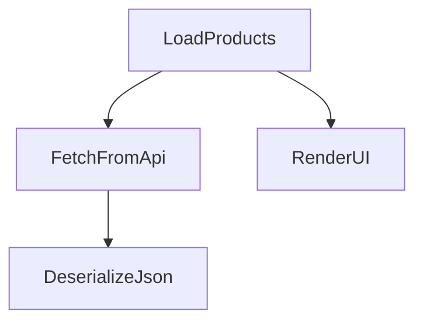
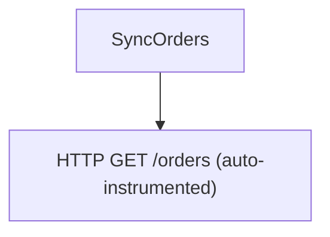
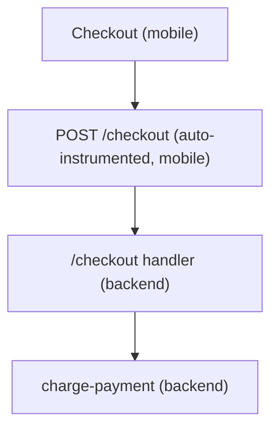

# Distributed Tracing Guide

This cookbook covers common distributed tracing patterns with the LaunchDarkly Observability SDK for React Native. Each recipe is self-contained and demonstrates a single concept with realistic examples.

All examples assume the SDK has already been initialized (see [Usage](../README.md#usage)) and the following imports are present:

```typescript
import { LDObserve } from '@launchdarkly/observability-react-native'
import { context, trace, SpanStatusCode } from '@opentelemetry/api'
```

Spans returned by the SDK are standard OpenTelemetry [`Span`](https://open-telemetry.github.io/opentelemetry-js/interfaces/_opentelemetry_api.Span.html) objects, so every span operation in this guide is the regular OpenTelemetry API.

> **A note on context propagation in React Native.** Unlike .NET's `AsyncLocal`, JavaScript does not automatically carry the active span across `await`, `setTimeout`, `Promise` callbacks, or event handlers in React Native. `startActiveSpan` makes a span active only for the synchronous portion of its callback (and any `await`s within the same callback). When you cross into a *detached* callback, you must pass context explicitly — see recipes 7 and 8.

---

## 1. Start a Root Span

Create an independent span that begins a brand-new trace by passing `{ root: true }`. Use `startActiveSpan` so the span is active for the duration of the callback and ends automatically when the callback returns.

```typescript
LDObserve.startActiveSpan(
  'app-cold-start',
  (span) => {
    span.setAttribute('launch_type', 'cold')
    span.setAttribute('device_model', Platform.constants.Model ?? 'unknown')
    span.addEvent('splash_rendered')

    // ... initialization work ...

    span.addEvent('home_screen_ready')
  },
  { root: true },
)
```

If you need to control the span's lifetime manually (for example, it ends in a different function), use `startSpan` and call `span.end()` yourself:

```typescript
const span = LDObserve.startSpan('app-cold-start', { root: true })
span.setAttribute('launch_type', 'cold')
// ... later ...
span.end()
```

Use `{ root: true }` when you want a span that is guaranteed to start a new trace, regardless of any ambient context.

---

## 2. Nested Spans for a Typical React Native Workflow

`startActiveSpan` automatically parents each new span under the currently active one. This is the most common pattern for tracing multi-step operations. Because the parent stays active for the entire `async` callback, spans started during `await`s nest correctly.

```typescript
async function loadProducts() {
  return LDObserve.startActiveSpan('LoadProducts', async (loadSpan) => {
    const products = await LDObserve.startActiveSpan(
      'FetchFromApi',
      async (fetchSpan) => {
        const response = await fetch('https://api.example.com/products')
        fetchSpan.setAttribute('http.status_code', response.status)
        const json = await response.text()

        return LDObserve.startActiveSpan('DeserializeJson', (parseSpan) => {
          const parsed = JSON.parse(json) as Product[]
          parseSpan.setAttribute('product_count', parsed.length)
          return parsed
        })
      },
    )

    LDObserve.startActiveSpan('RenderUI', (renderSpan) => {
      renderSpan.setAttribute('product_count', products.length)
      setProducts(products)
    })

    return products
  })
}
```

The resulting trace tree:



---

## 3. HTTP Call Span with Manual Error Handling

Wrap a network call in a span to capture timing, status codes, and errors in a single trace unit.

```typescript
async function fetchUserProfile(userId: string): Promise<UserProfile | null> {
  return LDObserve.startActiveSpan('FetchUserProfile', async (span) => {
    span.setAttribute('user.id', userId)
    span.setAttribute('http.method', 'GET')

    try {
      const url = `https://api.example.com/users/${userId}`
      span.setAttribute('http.url', url)

      const response = await fetch(url)
      span.setAttribute('http.status_code', response.status)

      if (!response.ok) {
        span.setStatus({ code: SpanStatusCode.ERROR })
        span.setAttribute('error.type', `HTTP ${response.status}`)
        return null
      }

      const profile = (await response.json()) as UserProfile
      span.setStatus({ code: SpanStatusCode.OK })
      return profile
    } catch (err) {
      span.recordException(err as Error)
      span.setStatus({ code: SpanStatusCode.ERROR })
      throw err
    } finally {
      span.end()
    }
  })
}
```

> When you call `startActiveSpan`, the span ends automatically once the callback's returned promise settles — but ending it yourself in a `finally` block is harmless and makes the lifetime explicit.

---

## 4. Automatic `fetch` / `XMLHttpRequest` Instrumentation Under a Custom Parent

The SDK auto-instruments `fetch` and `XMLHttpRequest` (unless `disableTraces` is set). Every network request generates its own span automatically. If a custom span is active at call time, the auto-generated HTTP span becomes its child.

```typescript
async function syncOrders() {
  await LDObserve.startActiveSpan('SyncOrders', async (span) => {
    span.setAttribute('sync.direction', 'pull')

    // The HTTP span for this fetch is auto-created as a child of "SyncOrders"
    const response = await fetch('https://api.example.com/orders?since=yesterday')
    span.setAttribute('http.status_code', response.status)

    const orders = (await response.json()) as Order[]
    span.setAttribute('order_count', orders.length)
  })
}
```

The resulting trace tree:



You do not need to create a span for the HTTP call itself; the SDK handles it. Your business-logic span provides the parent context. The key requirement is that the request happens while your span is **active** — i.e. inside a `startActiveSpan` callback.

---

## 5. Record Exception and Mark Span as Failed

Use `span.recordException` to attach structured error data to a span, then `span.setStatus` to mark it as failed. Pair it with `LDObserve.recordError` to surface the error in your error backend.

```typescript
async function processPayment(orderId: string, amount: number) {
  await LDObserve.startActiveSpan('ProcessPayment', async (span) => {
    span.setAttribute('order.id', orderId)
    span.setAttribute('payment.amount', amount)

    try {
      const result = await paymentGateway.charge(orderId, amount)
      span.setAttribute('payment.transaction_id', result.transactionId)
      span.setStatus({ code: SpanStatusCode.OK })
    } catch (err) {
      const error = err as Error
      span.recordException(error)
      span.setStatus({ code: SpanStatusCode.ERROR })
      span.setAttribute('error.category', error.name)

      // Pass the active span so the error attaches to it instead of a new one
      LDObserve.recordError(error, { 'order.id': orderId }, { span })
      throw err
    }
  })
}
```

`span.recordException` adds an `exception` event with `exception.type`, `exception.message`, and `exception.stacktrace` attributes following the OpenTelemetry semantic conventions. Passing `{ span }` to `recordError` records the error against the span you already created; omit it and the SDK attaches the error to the currently active span (or creates a short-lived one).

---

## 6. Correlated Logs Inside the Active Span

When a span is active, `LDObserve.recordLog` automatically picks up the ambient trace and span IDs from the active context. No extra work is needed to correlate them.

```typescript
async function importCatalog(rows: AsyncIterable<CatalogRow>) {
  await LDObserve.startActiveSpan('ImportCatalog', async (span) => {
    LDObserve.recordLog('Import started', 'info', { source: 'csv' })

    let imported = 0
    for await (const row of rows) {
      await db.upsertProduct(row)
      imported++
    }

    span.setAttribute('imported_count', imported)

    LDObserve.recordLog('Import completed', 'info', { imported_count: imported })
  })
}
```

Both log records carry the same `traceId` and `spanId` as the `ImportCatalog` span, linking them together in your observability backend.

---

## 7. Re-establishing Context to Correlate Logs Across Async Boundaries

The active context is not automatically restored inside a detached callback such as `setTimeout`, a timer, or an event handler that runs after the original `startActiveSpan` callback has returned. Capture the span's context with `LDObserve.getContextFromSpan` and re-activate it with `context.with` so the log correlates with the right span.

```typescript
function onUploadPressed() {
  const span = LDObserve.startSpan('UploadReport')
  span.setAttribute('report.type', 'daily')
  const capturedContext = LDObserve.getContextFromSpan(span)
  span.end()

  setTimeout(() => {
    // The active context is empty here -- re-establish it explicitly.
    context.with(capturedContext, () => {
      LDObserve.recordLog('Upload processing on background tick', 'info', {
        phase: 'start',
      })

      // ... heavy processing ...

      LDObserve.recordLog('Upload complete', 'info', { phase: 'end' })
    })
  }, 0)
}
```

Every `recordLog` call made inside `context.with(capturedContext, ...)` is stamped with the `UploadReport` span's `traceId` and `spanId`.

---

## 8. Creating a Child Span Where Automatic Propagation Won't Work

Sometimes you need a full child *span* (not just a correlated log) in a callback where the active context has been lost. Both `startSpan` and `startActiveSpan` accept an explicit parent `Context` as their final argument. Capture the parent's context with `getContextFromSpan` and pass it through.

```typescript
function startBackgroundSync() {
  LDObserve.startActiveSpan('ScheduleSync', (parentSpan) => {
    parentSpan.setAttribute('sync.mode', 'background')
    const parentContext = LDObserve.getContextFromSpan(parentSpan)

    // setTimeout drops the active context
    setTimeout(async () => {
      await LDObserve.startActiveSpan(
        'BackgroundSync',
        async (childSpan) => {
          const response = await fetch('https://api.example.com/sync')
          childSpan.setAttribute('http.status_code', response.status)
          childSpan.addEvent('sync.complete')
        },
        undefined, // no extra span options
        parentContext, // explicit parent context
      )
    }, 0)
  })
}
```

The same technique applies to recurring timer callbacks:

```typescript
function startPolling() {
  const span = LDObserve.startSpan('StartPolling')
  const parentContext = LDObserve.getContextFromSpan(span)
  span.end()

  setInterval(() => {
    // Interval callbacks run with no ambient span context
    LDObserve.startActiveSpan(
      'PollTick',
      (pollSpan) => {
        pollSpan.setAttribute('tick.time', new Date().toISOString())
        // ... polling logic ...
      },
      undefined,
      parentContext,
    )
  }, 30_000)
}
```

The resulting trace has `StartPolling` as the short-lived parent, with each `PollTick` appearing as a child span fired at 30-second intervals.

If you need a span that is *not* active but still parented explicitly, use `startSpan`:

```typescript
const childSpan = LDObserve.startSpan('DetachedWork', undefined, parentContext)
// ... do work ...
childSpan.end()
```

---

## 9. Sequential Independent Root Spans

Use `{ root: true }` to create spans that each begin a separate trace. This is useful for batch operations or analytics events where each item should be its own trace.

```typescript
function processAnalyticsQueue(events: AnalyticsEvent[]) {
  for (const evt of events) {
    LDObserve.startActiveSpan(
      `Analytics:${evt.type}`,
      (span) => {
        span.setAttribute('event.type', evt.type)
        span.setAttribute('event.timestamp', evt.timestamp)
        span.setAttribute('event.user_id', evt.userId)

        try {
          analyticsService.process(evt)
          span.setStatus({ code: SpanStatusCode.OK })
        } catch (err) {
          span.recordException(err as Error)
          span.setStatus({ code: SpanStatusCode.ERROR })
        }
      },
      { root: true },
    )
  }
}
```

Each iteration creates an independent trace. Without `{ root: true }`, successive `startActiveSpan` calls would nest under whatever span is currently active.

---

## 10. Span Events as Lightweight Checkpoints

Use `span.addEvent` to mark milestones within a long-running span without creating child spans. Events are cheaper than spans and ideal for logging progress through a linear pipeline.

```typescript
async function downloadAndCacheImage(url: string) {
  await LDObserve.startActiveSpan('DownloadAndCacheImage', async (span) => {
    span.setAttribute('image.url', url)

    span.addEvent('download.started')
    const response = await fetch(url)
    const blob = await response.blob()
    span.addEvent('download.completed')

    span.setAttribute('image.size_bytes', blob.size)

    span.addEvent('cache.write.started')
    const path = `${FileSystem.cacheDirectory}${fileNameFromUrl(url)}`
    await writeBlobToFile(path, blob)
    span.addEvent('cache.write.completed')

    span.setAttribute('cache.path', path)
  })
}
```

You can also attach attributes to an event: `span.addEvent('cache.write.completed', { bytes: blob.size })`.

---

## 11. Connecting Mobile Traces to Your Backend (End-to-End Distributed Tracing)

The real power of distributed tracing is linking a span on the device to the spans your backend produces for the same request. The SDK does this automatically by injecting a W3C `traceparent` header into outgoing requests — but **only** for URLs you opt in via the `tracingOrigins` option. This prevents leaking trace headers to third-party domains.

```typescript
new Observability({
  serviceName: 'my-react-native-app',
  // Attach trace headers to requests whose URL matches any of these entries.
  tracingOrigins: ['api.example.com', /\.internal\.example\.com$/],
})
```

With `tracingOrigins` configured, any `fetch`/`XHR` request to a matching host carries a `traceparent` header, so the backend continues the same trace:

```typescript
async function checkout(cartId: string) {
  await LDObserve.startActiveSpan('Checkout', async (span) => {
    span.setAttribute('cart.id', cartId)

    // traceparent is injected automatically because api.example.com is a tracing origin.
    // The backend span becomes a child of "Checkout" in the same trace.
    const response = await fetch('https://api.example.com/checkout', {
      method: 'POST',
      body: JSON.stringify({ cartId }),
    })
    span.setAttribute('http.status_code', response.status)
  })
}
```



### Continuing a trace from incoming headers

If your app receives work along with trace headers (for example, a push payload or a webhook-style message that carries `x-request-id` / `x-session-id`), use the header helpers to start a span annotated with that context:

```typescript
// Run a callback inside a span that records the incoming headers as attributes.
LDObserve.runWithHeaders('HandlePushPayload', incomingHeaders, (span) => {
  span.setAttribute('payload.kind', payload.kind)
  handlePayload(payload)
})

// Or get a span you end yourself:
const span = LDObserve.startWithHeaders('HandlePushPayload', incomingHeaders)
// ... work ...
span.end()

// Extract just the correlation IDs without starting a span:
const requestContext = LDObserve.parseHeaders(incomingHeaders)
// requestContext.sessionId, requestContext.requestId
```

### Suppressing propagation for specific URLs

Use `urlBlocklist` to ensure trace headers are never attached (and request bodies/headers are never recorded) for sensitive endpoints, even if they would otherwise match `tracingOrigins`:

```typescript
new Observability({
  tracingOrigins: ['api.example.com'],
  urlBlocklist: ['api.example.com/auth', 'api.example.com/payment'],
})
```

---

## Quick Reference

### Span Creation (`LDObserve`)

| Method | Parent | Returns |
|---|---|---|
| `startActiveSpan(name, fn, options?, ctx?)` | Current active span (or `ctx` if provided) | result of `fn` |
| `startActiveSpan(name, fn, { root: true })` | None (new trace) | result of `fn` |
| `startSpan(name, options?, ctx?)` | Current active span (or `ctx`); span is **not** made active | `Span` |
| `startSpan(name, { root: true })` | None (new trace) | `Span` |
| `runWithHeaders(name, headers, cb, options?)` | Current active span; records `http.header.*` attributes | result of `cb` |
| `startWithHeaders(name, headers, options?)` | Current active span; records `http.header.*` attributes | `Span` |
| `getContextFromSpan(span)` | -- | `Context` (for explicit re-parenting) |
| `parseHeaders(headers)` | -- | `RequestContext` (`sessionId`, `requestId`) |

> `startActiveSpan` ends its span automatically when the callback returns (awaiting the returned promise). `startSpan` requires a manual `span.end()`.

### Span Operations (OpenTelemetry `Span`)

| Method | Description |
|---|---|
| `span.setAttribute(key, value)` | Set a single key-value attribute on the span |
| `span.setAttributes({ ... })` | Set multiple attributes at once |
| `span.addEvent(name, attributes?)` | Record a named event (lightweight checkpoint) |
| `span.recordException(error)` | Attach exception details as a span event |
| `span.setStatus({ code: SpanStatusCode.OK })` | Mark the span as successful |
| `span.setStatus({ code: SpanStatusCode.ERROR })` | Mark the span as failed |
| `span.spanContext()` | Get the raw `SpanContext` (`traceId`, `spanId`, `traceFlags`) |
| `span.updateName(name)` | Rename the span |
| `span.end()` | Manually end the span |

### Logs, Errors, and Metrics (`LDObserve`)

| Method | Description |
|---|---|
| `recordLog(message, level, attributes?)` | Emit a structured log; auto-correlates with the active span |
| `recordError(error, attributes?, { span }?)` | Record an error; attaches to `span`, else the active span |
| `recordMetric(metric)` | Record a gauge value |
| `recordCount(metric)` | Add to a counter |
| `recordIncr(metric)` | Increment a counter by 1 |
| `recordHistogram(metric)` | Record a histogram value |
| `recordUpDownCounter(metric)` | Add to an up/down counter |
| `flush()` | Flush all pending telemetry (`Promise<void>`) |
| `getSessionInfo()` | Get the current session info |
| `isInitialized()` | Whether the observability client is ready |

> A `Metric` is `{ name: string; value: number; attributes?: Attributes; timestamp?: number }`.

### Context Helpers (`@opentelemetry/api`)

| Helper | Description |
|---|---|
| `trace.getActiveSpan()` | Get the currently active span, if any |
| `context.active()` | Get the currently active context |
| `context.with(ctx, fn)` | Run `fn` with `ctx` as the active context (re-establish across async boundaries) |
