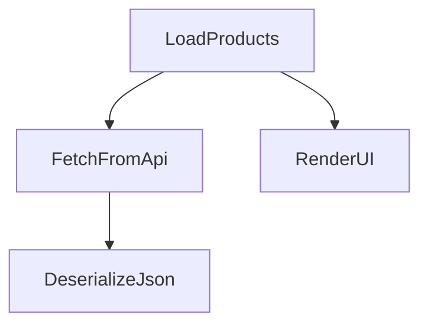
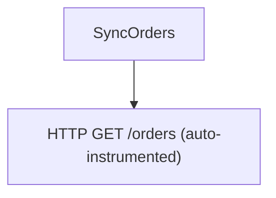
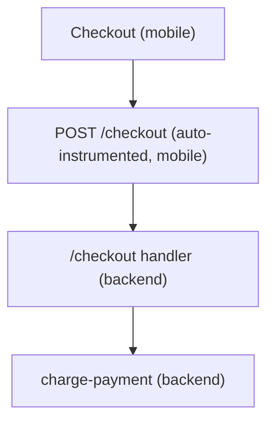

# Tracing Guide

This cookbook covers common tracing patterns with the LaunchDarkly Observability SDK for React Native — from simple spans to nested operations, error handling, correlated logs, and end-to-end mobile-to-backend distributed traces. Each recipe is self-contained and demonstrates a single concept with realistic examples.

All examples assume the SDK has already been initialized (see [Usage](../README.md#usage)) and the following imports are present:

```typescript
import { LDObserve } from '@launchdarkly/observability-react-native'
import { context, trace, SpanStatusCode } from '@opentelemetry/api'
```

Spans returned by the SDK are standard OpenTelemetry [`Span`](https://open-telemetry.github.io/opentelemetry-js/interfaces/_opentelemetry_api.Span.html) objects, so every span operation in this guide is the regular OpenTelemetry API.

> **A note on context propagation in React Native.** React Native uses OpenTelemetry's `StackContextManager` (there is no `AsyncLocalStorage`/`AsyncLocal` equivalent), so the active span is tracked **only synchronously**. It is **not** restored after an `await`, `setTimeout`, `Promise` callback, or event handler — including across `await`s *within the same* `startActiveSpan` callback. In practice this means anything created in the synchronous part of a callback (before the first `await`) is parented automatically, but any span or log created **after an `await`** would become a new root unless you parent it explicitly.
>
> The SDK provides [`LDObserve.withSpan`](#0-recommended-withspan-for-nested-async-work) to handle this for you — it ends spans automatically and parents children off a captured context, so the hierarchy survives `await`s without manual plumbing. **Prefer `withSpan` for nested async work.** The lower-level recipes below also show the explicit `startActiveSpan`/`startSpan` + `ctx` form so you understand what `withSpan` does under the hood, and for cases where you need full manual control.

---

## 0. Recommended: `withSpan` for nested async work

`LDObserve.withSpan(name, fn, options?)` starts a span, runs `fn` within it, and **ends it automatically** (status `OK` on success, `ERROR` with the error recorded if `fn` throws or rejects). The callback receives a `SpanScope` that solves the context-propagation problem above:

- `scope.span` — the underlying OpenTelemetry span (set attributes, add events, etc.).
- `scope.child(name, fn, options?)` — start a child span parented to **this** scope. Because the parent comes from the captured scope rather than the (lost) active context, children nest correctly **even after an `await`**, and even across concurrent (`Promise.all`) work.
- `scope.active(fn)` — run `fn` with this span active. Use it to parent **auto-instrumented** `fetch`/`XMLHttpRequest` spans that start *after* an `await` (see [recipe 4](#4-automatic-fetch--xmlhttprequest-instrumentation-under-a-custom-parent)).
- `scope.ctx` — this span's `Context`, for the rare case you need to pass an explicit parent elsewhere (e.g. a `setTimeout` callback — see [recipe 8](#8-creating-a-child-span-where-automatic-propagation-wont-work)).

The nested workflow from [recipe 2](#2-nested-spans-for-a-typical-react-native-workflow), written with `withSpan`:

```typescript
async function loadProducts() {
  return LDObserve.withSpan('LoadProducts', async (load) => {
    const products = await load.child('FetchFromApi', async (fetchScope) => {
      const response = await fetch('https://api.example.com/products')
      fetchScope.span.setAttribute('http.status_code', response.status)
      const json = await response.text()

      // Parents to FetchFromApi even though we are past two awaits.
      return fetchScope.child('DeserializeJson', (parseScope) => {
        const result = JSON.parse(json) as Product[]
        parseScope.span.setAttribute('product_count', result.length)
        return result
      })
    })

    // Parents to LoadProducts (not FetchFromApi) — uses the captured context.
    load.child('RenderUI', (renderScope) => {
      renderScope.span.setAttribute('product_count', products.length)
      setProducts(products)
    })

    return products
  })
}
```

No `getContextFromSpan`, no `ctx` threading, no manual `span.end()`. The trace tree is identical to recipe 2:



**Concurrency bonus.** `startActiveSpan` shares a single active-context stack, so interleaved `Promise.all` work corrupts parentage. `withSpan` does not — each `child` parents off its own captured context:

```typescript
await LDObserve.withSpan('LoadDashboard', async (root) => {
  const [profile, feed] = await Promise.all([
    root.child('fetch.profile', async ({ span }) => {
      const res = await fetch('https://api.example.com/me')
      span.setAttribute('http.status_code', res.status)
      return res.json()
    }),
    root.child('fetch.feed', async ({ span }) => {
      const res = await fetch('https://api.example.com/feed')
      span.setAttribute('http.status_code', res.status)
      return res.json()
    }),
  ])
  // both spans correctly parent to LoadDashboard
})
```

> `withSpan` is built entirely on the explicit `startSpan` + `parent` context mechanism shown in the recipes below — it is sugar, not magic. The one thing it cannot change is **auto-instrumented** `fetch`/XHR parenting after an `await`; use `scope.active(...)` there.

---

## 1. Start a Root Span

Create an independent span that begins a brand-new trace by passing `{ root: true }`. `startActiveSpan` makes the span active for the duration of the callback; as in standard OpenTelemetry, it does **not** end the span for you, so call `span.end()` when the work is done (otherwise the span is never exported).

```typescript
LDObserve.startActiveSpan(
  'app-cold-start',
  (span) => {
    span.setAttribute('launch_type', 'cold')
    span.setAttribute('device_model', Platform.constants.Model ?? 'unknown')
    span.addEvent('splash_rendered')

    // ... initialization work ...

    span.addEvent('home_screen_ready')
    span.end()
  },
  { root: true },
)
```

If you need to control the span's lifetime manually (for example, it ends in a different function), use `startSpan` and call `span.end()` yourself:

```typescript
const span = LDObserve.startSpan('app-cold-start', { root: true })
span.setAttribute('launch_type', 'cold')
// ... later ...
span.end()
```

Use `{ root: true }` when you want a span that is guaranteed to start a new trace, regardless of any ambient context.

---

## 2. Nested Spans for a Typical React Native Workflow

> For most code you should use [`LDObserve.withSpan`](#0-recommended-withspan-for-nested-async-work), which handles everything below automatically. This recipe shows the explicit form so you understand the underlying mechanism and can use it when you need full manual control.

`startActiveSpan` parents each new span under the currently active one — but only **synchronously**. In React Native the active context is lost after every `await` (see the note above), so a span created after an `await` would become a new root instead of nesting. To keep the hierarchy, capture each parent's context with `LDObserve.getContextFromSpan` and pass it as the final argument when you start a child after an `await`.

```typescript
async function loadProducts() {
  return LDObserve.startActiveSpan('LoadProducts', async (loadSpan) => {
    // The active context is lost across each `await`, so capture parents and
    // pass them explicitly to keep the LoadProducts > FetchFromApi >
    // DeserializeJson / RenderUI hierarchy.
    const loadCtx = LDObserve.getContextFromSpan(loadSpan)

    const products = await LDObserve.startActiveSpan(
      'FetchFromApi',
      async (fetchSpan) => {
        const fetchCtx = LDObserve.getContextFromSpan(fetchSpan)
        const response = await fetch('https://api.example.com/products')
        fetchSpan.setAttribute('http.status_code', response.status)
        const json = await response.text()

        // DeserializeJson runs after `await`, so parent it on fetchCtx.
        const parsed = LDObserve.startActiveSpan(
          'DeserializeJson',
          (parseSpan) => {
            const result = JSON.parse(json) as Product[]
            parseSpan.setAttribute('product_count', result.length)
            parseSpan.end()
            return result
          },
          undefined, // no extra span options
          fetchCtx, // explicit parent context
        )
        fetchSpan.end()
        return parsed
      },
      undefined,
      loadCtx, // FetchFromApi is started synchronously, but passing loadCtx is
      // harmless and keeps the intent explicit.
    )

    // RenderUI runs after the `await` above, so parent it on loadCtx.
    LDObserve.startActiveSpan(
      'RenderUI',
      (renderSpan) => {
        renderSpan.setAttribute('product_count', products.length)
        setProducts(products)
        renderSpan.end()
      },
      undefined,
      loadCtx,
    )

    loadSpan.end()
    return products
  })
}
```

> Without the explicit `ctx` arguments, `DeserializeJson` and `RenderUI` — both created after an `await` — would have no `parent_span_id` and show up as separate root traces instead of children of `LoadProducts`.

The resulting trace tree:


---

## 3. HTTP Call Span with Manual Error Handling

Wrap a network call in a span to capture timing, status codes, and errors in a single trace unit.

```typescript
async function fetchUserProfile(userId: string): Promise<UserProfile | null> {
  return LDObserve.startActiveSpan('FetchUserProfile', async (span) => {
    span.setAttribute('user.id', userId)
    span.setAttribute('http.method', 'GET')

    try {
      const url = `https://api.example.com/users/${userId}`
      span.setAttribute('http.url', url)

      const response = await fetch(url)
      span.setAttribute('http.status_code', response.status)

      if (!response.ok) {
        span.setStatus({ code: SpanStatusCode.ERROR })
        span.setAttribute('error.type', `HTTP ${response.status}`)
        return null
      }

      const profile = (await response.json()) as UserProfile
      span.setStatus({ code: SpanStatusCode.OK })
      return profile
    } catch (err) {
      span.recordException(err as Error)
      span.setStatus({ code: SpanStatusCode.ERROR })
      throw err
    } finally {
      span.end()
    }
  })
}
```

> `startActiveSpan` does not end the span for you. Always call `span.end()` yourself — a `finally` block is a good place so the span is closed even if the callback throws or returns early.

---

## 4. Automatic `fetch` / `XMLHttpRequest` Instrumentation Under a Custom Parent

The SDK auto-instruments `fetch` and `XMLHttpRequest` (unless `disableTraces` is set). Every network request generates its own span automatically. If a custom span is active at call time, the auto-generated HTTP span becomes its child.

```typescript
async function syncOrders() {
  await LDObserve.startActiveSpan('SyncOrders', async (span) => {
    span.setAttribute('sync.direction', 'pull')

    // The HTTP span for this fetch is auto-created as a child of "SyncOrders"
    const response = await fetch('https://api.example.com/orders?since=yesterday')
    span.setAttribute('http.status_code', response.status)

    const orders = (await response.json()) as Order[]
    span.setAttribute('order_count', orders.length)
    span.end()
  })
}
```

The resulting trace tree:



You do not need to create a span for the HTTP call itself; the SDK handles it. Your business-logic span provides the parent context. The key requirement is that the request happens while your span is **active** — i.e. inside a `startActiveSpan` (or `withSpan`) callback.

The same recipe with `withSpan` (note the request is in the synchronous window before the first `await`, so it auto-parents):

```typescript
async function syncOrders() {
  await LDObserve.withSpan('SyncOrders', async ({ span }) => {
    span.setAttribute('sync.direction', 'pull')
    const response = await fetch('https://api.example.com/orders?since=yesterday')
    span.setAttribute('http.status_code', response.status)
    const orders = (await response.json()) as Order[]
    span.setAttribute('order_count', orders.length)
  })
}
```

> **After an `await`, the active context is gone**, so a `fetch` started later would create a *root* HTTP span. Auto-instrumentation reads the active context at call time and can't see your captured scope — so wrap such calls in `scope.active(...)`:
>
> ```typescript
> await LDObserve.withSpan('Checkout', async (scope) => {
>   const cart = await loadCart() // <- await drops the active context
>   // Re-establish it so the auto HTTP span parents to "Checkout":
>   const res = await scope.active(() =>
>     fetch('https://api.example.com/checkout', { method: 'POST' }),
>   )
>   scope.span.setAttribute('http.status_code', res.status)
> })
> ```

---

## 5. Record Exception and Mark Span as Failed

Use `span.recordException` to attach structured error data to a span, then `span.setStatus` to mark it as failed. Pair it with `LDObserve.recordError` to surface the error in your error backend.

```typescript
async function processPayment(orderId: string, amount: number) {
  await LDObserve.startActiveSpan('ProcessPayment', async (span) => {
    span.setAttribute('order.id', orderId)
    span.setAttribute('payment.amount', amount)

    try {
      const result = await paymentGateway.charge(orderId, amount)
      span.setAttribute('payment.transaction_id', result.transactionId)
      span.setStatus({ code: SpanStatusCode.OK })
    } catch (err) {
      const error = err as Error
      span.recordException(error)
      span.setStatus({ code: SpanStatusCode.ERROR })
      span.setAttribute('error.category', error.name)

      // Pass the active span so the error attaches to it instead of a new one
      LDObserve.recordError(error, { 'order.id': orderId }, { span })
      throw err
    } finally {
      span.end()
    }
  })
}
```

`span.recordException` adds an `exception` event with `exception.type`, `exception.message`, and `exception.stacktrace` attributes following the OpenTelemetry semantic conventions. Passing `{ span }` to `recordError` records the error against the span you already created; omit it and the SDK attaches the error to the currently active span (or creates a short-lived one).

---

## 6. Correlated Logs Inside the Active Span

When a span is active, `LDObserve.recordLog` automatically picks up the ambient trace and span IDs from the active context. That works for logs emitted in the **synchronous** part of the callback. After an `await` the active context is gone (see the note above), so re-establish it with `context.with(capturedContext, ...)` for any log you emit later.

```typescript
async function importCatalog(rows: AsyncIterable<CatalogRow>) {
  await LDObserve.startActiveSpan('ImportCatalog', async (span) => {
    const ctx = LDObserve.getContextFromSpan(span)

    // Synchronous: picks up the active span automatically.
    LDObserve.recordLog('Import started', 'info', { source: 'csv' })

    let imported = 0
    for await (const row of rows) {
      await db.upsertProduct(row)
      imported++
    }

    span.setAttribute('imported_count', imported)

    // After the `await` loop the active context is gone, so re-establish it so
    // this log still correlates with the ImportCatalog span.
    context.with(ctx, () => {
      LDObserve.recordLog('Import completed', 'info', { imported_count: imported })
    })
    span.end()
  })
}
```

Both log records carry the same `traceId` and `spanId` as the `ImportCatalog` span, linking them together in your observability backend — the first because the span is active synchronously, the second because `context.with` re-establishes that span's context.

---

## 7. Re-establishing Context to Correlate Logs Across Async Boundaries

The active context is not automatically restored inside a detached callback such as `setTimeout`, a timer, or an event handler that runs after the original `startActiveSpan` callback has returned. Capture the span's context with `LDObserve.getContextFromSpan` and re-activate it with `context.with` so the log correlates with the right span.

```typescript
function onUploadPressed() {
  const span = LDObserve.startSpan('UploadReport')
  span.setAttribute('report.type', 'daily')
  const capturedContext = LDObserve.getContextFromSpan(span)
  span.end()

  setTimeout(() => {
    // The active context is empty here -- re-establish it explicitly.
    context.with(capturedContext, () => {
      LDObserve.recordLog('Upload processing on background tick', 'info', {
        phase: 'start',
      })

      // ... heavy processing ...

      LDObserve.recordLog('Upload complete', 'info', { phase: 'end' })
    })
  }, 0)
}
```

Every `recordLog` call made inside `context.with(capturedContext, ...)` is stamped with the `UploadReport` span's `traceId` and `spanId`.

---

## 8. Creating a Child Span Where Automatic Propagation Won't Work

Sometimes you need a full child *span* (not just a correlated log) in a callback where the active context has been lost. Both `startSpan` and `startActiveSpan` accept an explicit parent `Context` as their final argument. Capture the parent's context with `getContextFromSpan` and pass it through.

```typescript
function startBackgroundSync() {
  LDObserve.startActiveSpan('ScheduleSync', (parentSpan) => {
    parentSpan.setAttribute('sync.mode', 'background')
    const parentContext = LDObserve.getContextFromSpan(parentSpan)

    // setTimeout drops the active context
    setTimeout(async () => {
      await LDObserve.startActiveSpan(
        'BackgroundSync',
        async (childSpan) => {
          const response = await fetch('https://api.example.com/sync')
          childSpan.setAttribute('http.status_code', response.status)
          childSpan.addEvent('sync.complete')
          childSpan.end()
        },
        undefined, // no extra span options
        parentContext, // explicit parent context
      )
    }, 0)
    parentSpan.end()
  })
}
```

The same technique applies to recurring timer callbacks:

```typescript
function startPolling() {
  const span = LDObserve.startSpan('StartPolling')
  const parentContext = LDObserve.getContextFromSpan(span)
  span.end()

  setInterval(() => {
    // Interval callbacks run with no ambient span context
    LDObserve.startActiveSpan(
      'PollTick',
      (pollSpan) => {
        pollSpan.setAttribute('tick.time', new Date().toISOString())
        // ... polling logic ...
        pollSpan.end()
      },
      undefined,
      parentContext,
    )
  }, 30_000)
}
```

The resulting trace has `StartPolling` as the short-lived parent, with each `PollTick` appearing as a child span fired at 30-second intervals.

If you need a span that is *not* active but still parented explicitly, use `startSpan`:

```typescript
const childSpan = LDObserve.startSpan('DetachedWork', undefined, parentContext)
// ... do work ...
childSpan.end()
```

---

## 9. Sequential Independent Root Spans

Use `{ root: true }` to create spans that each begin a separate trace. This is useful for batch operations or analytics events where each item should be its own trace.

```typescript
function processAnalyticsQueue(events: AnalyticsEvent[]) {
  for (const evt of events) {
    LDObserve.startActiveSpan(
      `Analytics:${evt.type}`,
      (span) => {
        span.setAttribute('event.type', evt.type)
        span.setAttribute('event.timestamp', evt.timestamp)
        span.setAttribute('event.user_id', evt.userId)

        try {
          analyticsService.process(evt)
          span.setStatus({ code: SpanStatusCode.OK })
        } catch (err) {
          span.recordException(err as Error)
          span.setStatus({ code: SpanStatusCode.ERROR })
        } finally {
          span.end()
        }
      },
      { root: true },
    )
  }
}
```

Each iteration creates an independent trace. Without `{ root: true }`, successive `startActiveSpan` calls would nest under whatever span is currently active.

---

## 10. Span Events as Lightweight Checkpoints

Use `span.addEvent` to mark milestones within a long-running span without creating child spans. Events are cheaper than spans and ideal for logging progress through a linear pipeline.

```typescript
async function downloadAndCacheImage(url: string) {
  await LDObserve.startActiveSpan('DownloadAndCacheImage', async (span) => {
    span.setAttribute('image.url', url)

    span.addEvent('download.started')
    const response = await fetch(url)
    const blob = await response.blob()
    span.addEvent('download.completed')

    span.setAttribute('image.size_bytes', blob.size)

    span.addEvent('cache.write.started')
    const path = `${FileSystem.cacheDirectory}${fileNameFromUrl(url)}`
    await writeBlobToFile(path, blob)
    span.addEvent('cache.write.completed')

    span.setAttribute('cache.path', path)
    span.end()
  })
}
```

You can also attach attributes to an event: `span.addEvent('cache.write.completed', { bytes: blob.size })`.

---

## 11. Connecting Mobile Traces to Your Backend (End-to-End Distributed Tracing)

The real power of distributed tracing is linking a span on the device to the spans your backend produces for the same request. The SDK does this automatically by injecting a W3C `traceparent` header into outgoing requests — but **only** for URLs you opt in via the `tracingOrigins` option. This prevents leaking trace headers to third-party domains.

```typescript
new Observability({
  serviceName: 'my-react-native-app',
  // Attach trace headers to requests whose URL matches any of these entries.
  tracingOrigins: ['api.example.com', /\.internal\.example\.com$/],
})
```

With `tracingOrigins` configured, any `fetch`/`XHR` request to a matching host carries a `traceparent` header, so the backend continues the same trace:

```typescript
async function checkout(cartId: string) {
  await LDObserve.startActiveSpan('Checkout', async (span) => {
    span.setAttribute('cart.id', cartId)

    // traceparent is injected automatically because api.example.com is a tracing origin.
    // The backend span becomes a child of "Checkout" in the same trace.
    const response = await fetch('https://api.example.com/checkout', {
      method: 'POST',
      body: JSON.stringify({ cartId }),
    })
    span.setAttribute('http.status_code', response.status)
    span.end()
  })
}
```



### Continuing a trace from incoming headers

If your app receives work along with trace headers (for example, a push payload or a webhook-style message that carries `x-request-id` / `x-session-id`), use the header helpers to start a span annotated with that context:

```typescript
// Run a callback inside a span that records the incoming headers as attributes.
LDObserve.runWithHeaders('HandlePushPayload', incomingHeaders, (span) => {
  span.setAttribute('payload.kind', payload.kind)
  handlePayload(payload)
})

// Or get a span you end yourself:
const span = LDObserve.startWithHeaders('HandlePushPayload', incomingHeaders)
// ... work ...
span.end()

// Extract just the correlation IDs without starting a span:
const requestContext = LDObserve.parseHeaders(incomingHeaders)
// requestContext.sessionId, requestContext.requestId
```

### Suppressing propagation for specific URLs

Use `urlBlocklist` to ensure trace headers are never attached (and request bodies/headers are never recorded) for sensitive endpoints, even if they would otherwise match `tracingOrigins`:

```typescript
new Observability({
  tracingOrigins: ['api.example.com'],
  urlBlocklist: ['api.example.com/auth', 'api.example.com/payment'],
})
```

---

## 12. Propagating Baggage Across Spans and Services

Baggage is a set of key-value pairs that travels with the active context — across child spans and, when a request targets one of your `tracingOrigins`, across the network to your backend via the W3C `baggage` header. The SDK registers a `W3CBaggagePropagator` by default, so you only need the standard OpenTelemetry baggage API.

Add the import:

```typescript
import { propagation } from '@opentelemetry/api'
```

Set baggage and run work within it. Spans started inside the callback — and outgoing `fetch`/`XHR` requests to tracing origins — carry these entries:

```typescript
function withTenantContext<T>(tenantId: string, tier: string, fn: () => T): T {
  const baggage = propagation.createBaggage({
    'app.tenant_id': { value: tenantId },
    'app.user_tier': { value: tier },
  })
  return context.with(propagation.setBaggage(context.active(), baggage), fn)
}

withTenantContext('acme', 'gold', () => {
  LDObserve.startActiveSpan('LoadDashboard', async (span) => {
    // api.example.com is a tracing origin -> the `baggage` header
    // (app.tenant_id=acme,app.user_tier=gold) is sent to the backend.
    await fetch('https://api.example.com/dashboard')
    span.end()
  })
})
```

Read baggage anywhere it is active:

```typescript
const current = propagation.getActiveBaggage()
const tenantId = current?.getEntry('app.tenant_id')?.value
```

Add to (or update) existing baggage without dropping what is already there — `Baggage` is immutable, so each change returns a new instance:

```typescript
const existing = propagation.getActiveBaggage() ?? propagation.createBaggage()
const updated = existing.setEntry('app.experiment', { value: 'new-checkout' })

context.with(propagation.setBaggage(context.active(), updated), () => {
  // ... work that should see the added entry ...
})
```

> **Baggage is not automatically copied onto spans.** It rides along the context and is sent to the backend, but it does not become span attributes unless you put it there. Copy the entries you want to query on explicitly:
>
> ```typescript
> const bag = propagation.getActiveBaggage()
> bag?.getAllEntries().forEach(([key, entry]) => span.setAttribute(key, entry.value))
> ```

Like trace headers, the `baggage` header is only attached to requests whose URL matches `tracingOrigins`, and `urlBlocklist` suppresses it. Avoid putting sensitive data in baggage, and keep entries small — they are sent on every matching request.

---

## Quick Reference

### Span Creation (`LDObserve`)

| Method | Parent | Returns |
|---|---|---|
| `withSpan(name, fn, options?)` | Captured scope context (or `options.parent`); **auto-ends** the span | result of `fn` |
| `startActiveSpan(name, fn, options?, ctx?)` | Current active span (or `ctx` if provided) | result of `fn` |
| `startActiveSpan(name, fn, { root: true })` | None (new trace) | result of `fn` |
| `startSpan(name, options?, ctx?)` | Current active span (or `ctx`); span is **not** made active | `Span` |
| `startSpan(name, { root: true })` | None (new trace) | `Span` |
| `runWithHeaders(name, headers, cb, options?)` | Current active span; records `http.header.*` attributes | result of `cb` |
| `startWithHeaders(name, headers, options?)` | Current active span; records `http.header.*` attributes | `Span` |
| `getContextFromSpan(span)` | -- | `Context` (for explicit re-parenting) |
| `parseHeaders(headers)` | -- | `RequestContext` (`sessionId`, `requestId`) |

> Both `startActiveSpan` and `startSpan` require a manual `span.end()`. The difference is that `startActiveSpan` makes the span active (the current parent) for the duration of its callback, while `startSpan` does not change the active context. `withSpan` is the recommended wrapper: it ends the span automatically and its `scope.child(...)` keeps nesting correct across `await`s.

> **`withSpan` scope** — the callback receives a `SpanScope`: `scope.span` (the OTel `Span`), `scope.child(name, fn, options?)` (start a correctly-parented child), `scope.active(fn)` (run with this span active, e.g. for auto-instrumented `fetch`/XHR after an `await`), and `scope.ctx` (the span's `Context`).

### Span Operations (OpenTelemetry `Span`)

| Method | Description |
|---|---|
| `span.setAttribute(key, value)` | Set a single key-value attribute on the span |
| `span.setAttributes({ ... })` | Set multiple attributes at once |
| `span.addEvent(name, attributes?)` | Record a named event (lightweight checkpoint) |
| `span.recordException(error)` | Attach exception details as a span event |
| `span.setStatus({ code: SpanStatusCode.OK })` | Mark the span as successful |
| `span.setStatus({ code: SpanStatusCode.ERROR })` | Mark the span as failed |
| `span.spanContext()` | Get the raw `SpanContext` (`traceId`, `spanId`, `traceFlags`) |
| `span.updateName(name)` | Rename the span |
| `span.end()` | Manually end the span |

### Logs, Errors, and Metrics (`LDObserve`)

| Method | Description |
|---|---|
| `recordLog(message, level, attributes?)` | Emit a structured log; auto-correlates with the active span |
| `recordError(error, attributes?, { span }?)` | Record an error; attaches to `span`, else the active span |
| `recordMetric(metric)` | Record a gauge value |
| `recordCount(metric)` | Add to a counter |
| `recordIncr(metric)` | Increment a counter by 1 |
| `recordHistogram(metric)` | Record a histogram value |
| `recordUpDownCounter(metric)` | Add to an up/down counter |
| `flush()` | Flush all pending telemetry (`Promise<void>`) |
| `getSessionInfo()` | Get the current session info |
| `isInitialized()` | Whether the observability client is ready |

> A `Metric` is `{ name: string; value: number; attributes?: Attributes; timestamp?: number }`.

### Context Helpers (`@opentelemetry/api`)

| Helper | Description |
|---|---|
| `trace.getActiveSpan()` | Get the currently active span, if any |
| `context.active()` | Get the currently active context |
| `context.with(ctx, fn)` | Run `fn` with `ctx` as the active context (re-establish across async boundaries) |
| `propagation.getActiveBaggage()` | Get the baggage from the active context, if any |
| `propagation.createBaggage(entries?)` | Create a `Baggage` (e.g. `{ key: { value } }`) |
| `propagation.setBaggage(ctx, baggage)` | Return a new context with the baggage attached |
| `baggage.setEntry` / `getEntry` / `getAllEntries` | Read or modify baggage entries (immutable; returns a new `Baggage`) |
